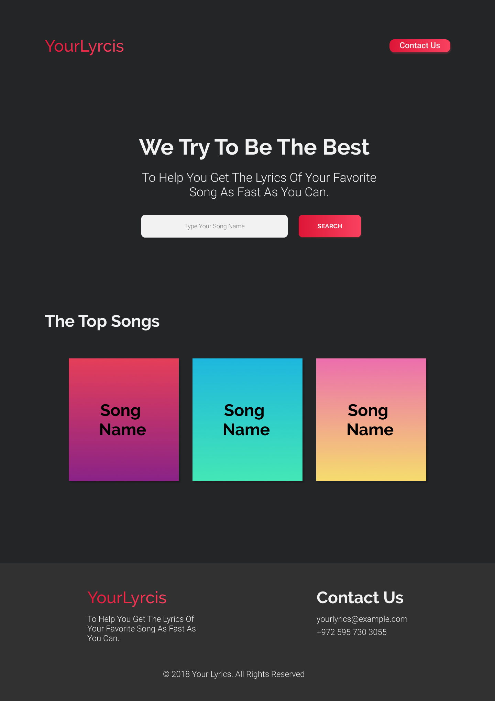
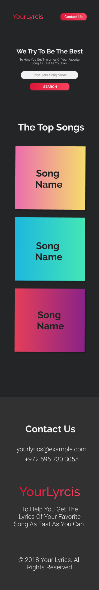
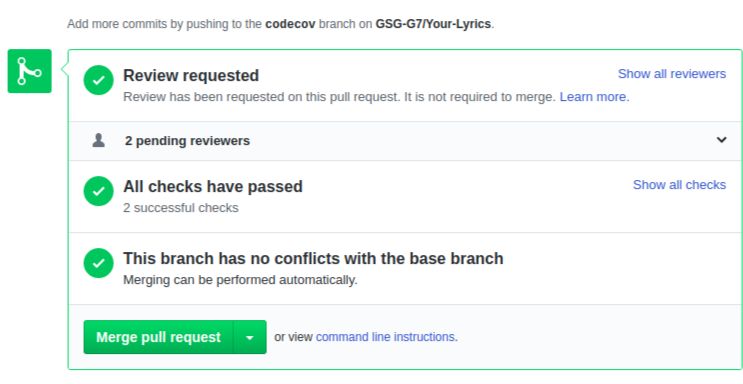
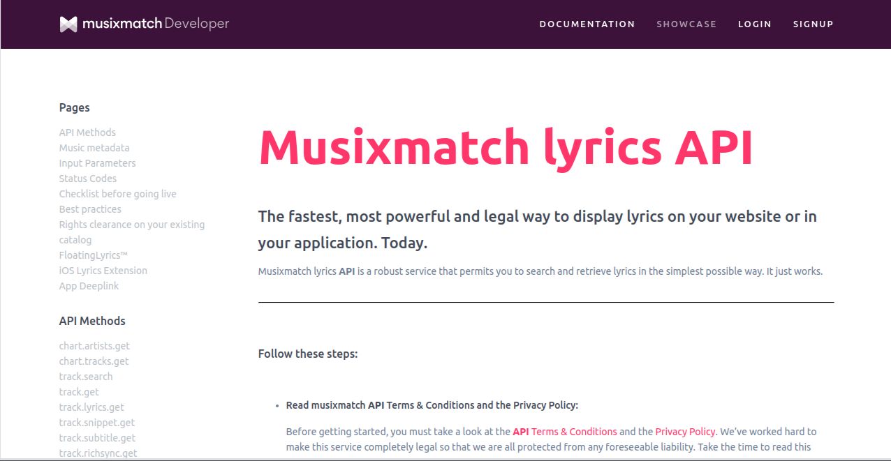

# Your-Lyrics
Music Lyrics web app  - by using Musixmatch API .

## TEAM NAMES:
- Mai Ubeid
- yosef ElNajaar
- Asem Abu Msameh
- Asmaa Thabet

## Our Idea : 
  a Website that display Song Lyrics when we search about the song . 

## Our website Prototype :  

## WHY ? 
  we make this website to request API in the back end and display the response in the browser . 

## WHAT?
  Our Lyrics website is a single page that help our clients in displaying their searched Song Lyrics . 

## HOW?
We divided our project in to Stages:
 
* Searching for suitables API's :
  we started our work by searching for the suitable API  which is should be Free and have unlimited number of requests so we choose Musixmatch API .

* Design :  
  We design our project on papers to make a general perception for the website.

* Project Structure : 
  We started to build our project files Structure by seprate our project into three folders which is public,src and test to make our work more organized.

* Setup Travis in our project : 
  We setup travis in the begining of our project 
to test our project with its test step by step . 

* Divided Tasks :
  We divided the work in tasks and started to work as pairs, Every Pair Started to work in their task.

* making tests : 
  we made tests for our routes and logic functions to check that they were work well .

* Fetching Data From API : 
  We work in Fetching data from API in the back end by fetch API Requests and makeing connections between client and server .

* Displaying Data In Page : 
  We show our fetched data by using dom js .

* Refactor code : 
  we made refactor for our code to raise our code performance .

* Design Website : 
  We make the design for our page to obtain the required shape from our idea and be sure that it works in mobile status as required.

* Responsive and Accessbility : 
  We chekout the Responsive case especially mobile status for our design and also check accessbility for the app to work in the better case.
  Mobile View: 
  > Mobile View: 

* Use Heroku :
  we use our Heroku to connect it with github and have a link to our project . 

* checking and Fixing issues : 
  Solve The issues that appears and take suggestions in mind and try to add it all to have a great website . 

## User Journey
* The User open our Website and see Landing page that contain descriptive header for using our page.
* The User can see our contact details by press on contact us button.
* The User can type the song name and get lyrics for it .
* The User also can see top songs .
* The User reach to footer section that have the contact detials.

## Special Features used In our project:

### Continuous Integration (CI):
we use travis for cI to check our project with the test to be sure from our work .

### Code Coverage :
we use Nyc code coverage method to be sure from our tests .

## Used API :

> The MusixMatch API [MusixMatch website](https://www.musixmatch.com/):
  you can find it by : [MusixMatchAPI](https://developer.musixmatch.com/documentation)

